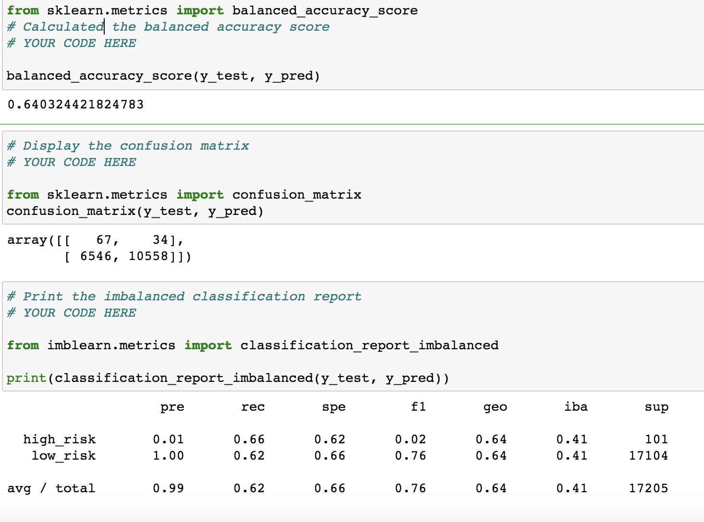

# Credit_Risk_Analysis

## Overview of the Analysis

## Purpose

A dataset was gathered from a hypothetical LendingClub, a peer-to-peer lending services company,who wants to use
machine learning to predict credit risk of their comany. They need help building and evaluating several ML models,
oversampling and undersampling the data, and evaluataing the performance of the models to determine how well they 
predict data. Management believes this will provide a more reliable loan experience, and lead to a more accurate
identification of good candidates for loans.

## Results

### Outputs form All Six Models
      
      . The naive Random Overampling algorithm resulted in a balanced accuracy score of 0.64. the precision score was
        1.0 for predicting low risk, but also extremely for predicting high risk 0.01. The recall score was 0.66 for high
        risk and 0.62 for low risk.
            
            
            
        
      . The SMOTE algorithm resulted in a balanced accuracy score of 0.65. The presision for for predicting the high and low
        risk was the same as the naive random oversampling algorithm. the recall scores were 0.61 for high and 0.69 for low risk
        respectively.
        
        
      . The Cluster Centroids algorithm resulted in as balanced accuracy score of 0.65. The precision for predicting high risk was 
        as consistance with the previous ones. The recall scores were 0.69 and 0.61 high and low risk, respectively.
      
      
      
      . The SMOTEENN algorithm reulted in a balanced accuracy score of 0.64. While the precision for prdicting high and low risk was 
        the same as the those above. The recall scores were 0.71 and 0.57 for the high and low risk.
        
        
      . The Balanced Random Forest Classifier resulted in a balanced accuracy score of 0.79. The Precision score was 1.0 for the low
        risk and 0.03 for the high risk. The recall score was 0.70 and 0.87 for the low and high risk respectively. 
        
        
      . The Easy Ensuremble Classifier result in a balanced accuary score of 0.92. The precision score was 0.05 for the high  risk and
        1.00 for the low risk. The recall scores was 0.93 for the high and 0.90 for the risk.

## Summery
  Overall, using the Random sampling and the Combination of (over and under)sampling data, the alogrithm for the  Random Oversampling
  balance accuracy score was 0.64, while while the combination of both smapling algorithm yield the same low balance accuracy 
  score of. 0.64
  The precision score for predicting high and low risk for Random Oversampling, SMOTE Oversampling, Cluster Centroids, 
  and SMOTEENN yield the same outcome of 0.01 and 1.00 respectively. The Balanced Random Forest Classifier has precision score 
  for high risk as 0.03, but the low risk remined the same as those above. And for the Easy Ensemble Classifier, the precision 
  score for predicting high risk is 0.05, but the low risk stays the same as the rest. The  Easy Ensemble Classifier has the 
  highest recall scores of 0.93 and 0.90 for high and low risk, respectively. From this report, i would recommand for the 
  Random Oversampling and the combination of(Over and Under) sampling algorithm be use since they have the same balance 
  accuracy scores.
      
